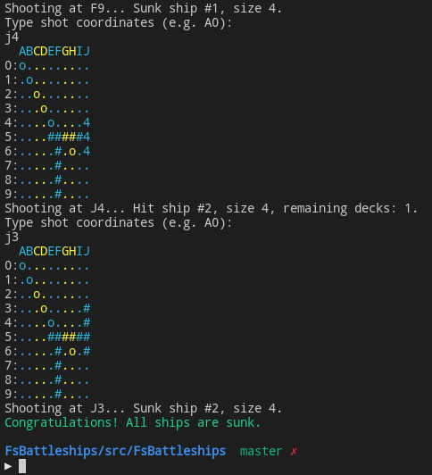
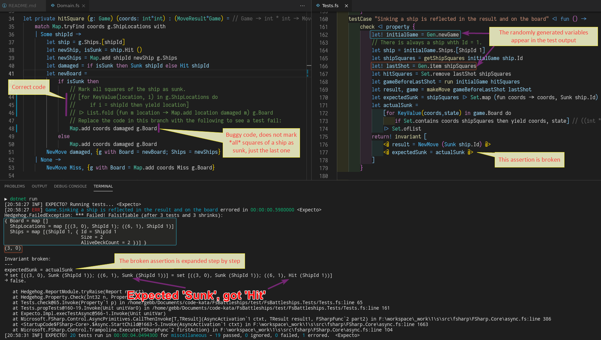

# Battleships

A code kata implementing a simple game of battleships aginst the computer.

## Demo

Screensot of a game:



## Features

### F\#

Written in F#, leveraging pure functions and immutable data structures where possible.

### Property-based tests

The game logic is covered by property-based tests using the
[Hedgehog](https://github.com/hedgehogqa/fsharp-hedgehog) library.
Property-based tests are like normal unit tests, but instead of
specifying concrete input data in the "arrange" step, we have the library generate
it randomly for us, which increases coverage and allows catching more edge cases.

Here is an example of how a property test finds a bug.



Note the "3 shrinks" text in the test output.
It means the following. When Hedgehog finds an input breaking the assertion, it does not report it
immediately, first it tries to reproduce the failure with smaller similar-looking inputs, and
reports the smallest one found.

## Building and running

Prerequisites: .Net 5 SDK.

```sh
cd ./src/FsBattleships
dotnet run
```

Usage:

- type shot coordinates,
- observe the result,
- repeat from step 1 until all ships are sunk.

## Running tests

The tests are written using the [Expecto](https://github.com/haf/expecto) library.

Run them as a normal console application:

```sh
cd ./test/FsBattleships.Tests
dotnet run
```
